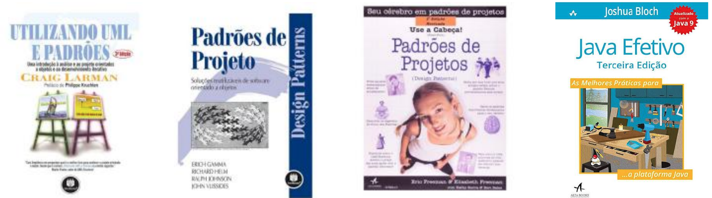

# map_2026.2
> **Disciplina:** Métodos Avançados de Programação (MAP) — UEPB  **Professora:** Luciana de Queiroz Leal Gomes

Atividades e Anotações da disciplina de Métodos Avançados de Programação no período 2026.2

## Referências

- Utilizando UML e Padrões, Craig Larman, 3ª ed., Bookman, 2017.
- Padrões de Projeto: Soluções Reutilizáveis de Software Orientado a Objetos, Gamma, Helm, Johnson e Vlissides, Bookman, 2000.
- Use a Cabeça! Padrões de Projeto, Eric Freeman e Elisabeth Freeman, 2ª ed., Alta Books.
- Java Efetivo, Joshua Bloch, 3ª ed., Alta Books, 2018.
